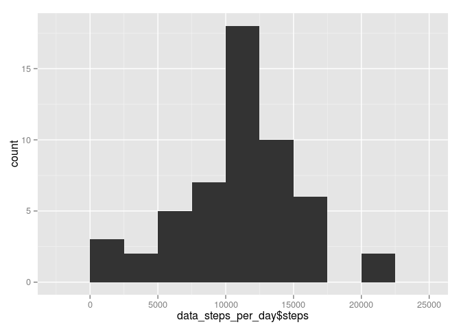
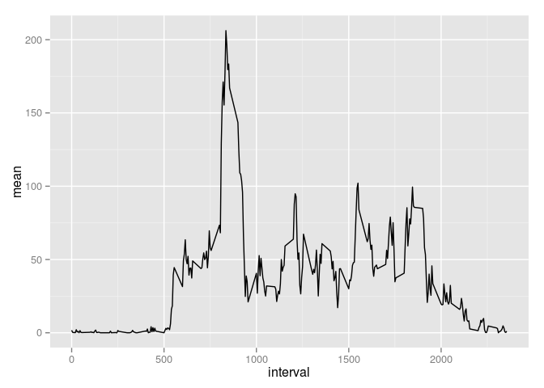
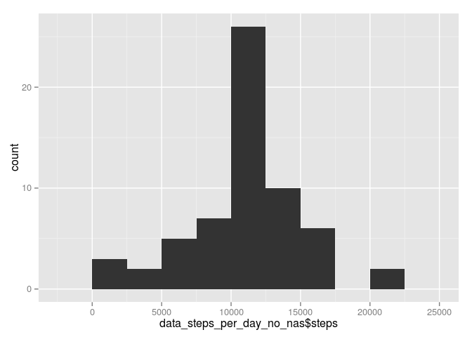
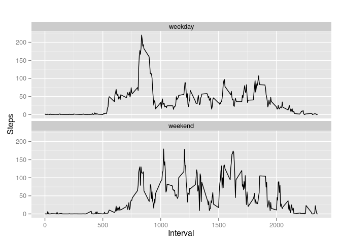

# Reproducible Research: Peer Assessment 1


## Loading and preprocessing the data


```r
# 1-) Code for reading in the dataset and/or processing the data
library(ggplot2)
library(dplyr)

# Read data file in the same directory
data <- read.csv('activity.csv')
```

## What is mean total number of steps taken per day?


```r
# Data grouped by date while summing steps
data_steps_per_day <-
  na.omit(data)%>% 
  group_by(date) %>% 
  summarise(steps = sum(steps))

#2-)Histogram of the total number of steps taken each day
# Create histogram of total number of steps in a day
ggplot(data_steps_per_day, aes(x=data_steps_per_day$steps)) + geom_bar(binwidth = 2500)
```

<!-- -->

```r
#3-)Mean and median number of steps taken each day
#m Mean per day
data_steps_per_day_mean <- mean(data_steps_per_day$steps)

# Median per day
data_steps_per_day_median <- median(data_steps_per_day$steps)
```
The mean is 1.0766189\times 10^{4}
The median is 10765

## What is the average daily activity pattern?


```r
# Mean by interval
data_steps_average_per_interval  <- 
  na.omit(data)%>% 
  group_by(interval) %>% 
  summarise(mean = mean(steps))

#4-)Time series plot of the average number of steps taken
# Time series plot for average number of steps taken
ggplot(data_steps_average_per_interval, aes(x=interval, y= mean))+geom_line()
```

<!-- -->

```r
#5-)The 5-minute interval that, on average, contains the maximum number of steps
# Interval with max mean
data_steps_average_per_interval_max <-
  data_steps_average_per_interval %>% 
  top_n(n=1)
```

```
## Selecting by mean
```

```r
data_steps_average_per_interval_max$interval
```

```
## [1] 835
```
The 5-minute interval that, on average, contains the maximum number of steps is 835


## Imputing missing values


```r
#6-)Code to describe and show a strategy for imputing missing data
# Missing Values
num_nas <- sum(is.na(data$steps))

# The strategy is to get the average of 5 minutei nterval

data_no_nas <- data

# Change NAs using 5 minute interval data frame as lookup
for (i in 1:nrow(data_no_nas)) {
  if(is.na(data_no_nas$steps[i])){
    data_no_nas$steps[i] <- data_steps_average_per_interval[data_steps_average_per_interval$interval == data_no_nas$interval[i],]$mean
  }
}

data_steps_per_day_no_nas <-
  data_no_nas%>% 
  group_by(date) %>% 
  summarise(steps = sum(steps))

#7-)Histogram of the total number of steps taken each day after missing values are imputed
# Create histogram of total number of steps in a day with no NAs
ggplot(data_steps_per_day_no_nas, aes(x=data_steps_per_day_no_nas$steps)) + geom_bar(binwidth = 2500)
```

<!-- -->

```r
# Mean per day
data_steps_per_day_mean_no_nas <- mean(data_steps_per_day_no_nas$steps)

# Median per day
data_steps_per_day_median_no_nas <- median(data_steps_per_day_no_nas$steps)
```
The mean is 1.0766189\times 10^{4}
The median is 1.0766189\times 10^{4}

Only the median increases

## Are there differences in activity patterns between weekdays and weekends?


```r
#8-) Panel plot comparing the average number of steps taken per 5-minute interval across weekdays and weekends
#Add weekday attribute
data_steps_per_day_no_nas_weekday<-data_no_nas
data_steps_per_day_no_nas_weekday$day_type <- weekdays(as.Date(data_steps_per_day_no_nas_weekday$date))
data_steps_per_day_no_nas_weekday$day_type[data_steps_per_day_no_nas_weekday$day_type  %in% c('sabado','domingo') ] <- "weekend"
data_steps_per_day_no_nas_weekday$day_type[data_steps_per_day_no_nas_weekday$day_type != "weekend"] <- "weekday"
data_steps_per_day_no_nas_weekday$day_type <- as.factor(data_steps_per_day_no_nas_weekday$day_type)

data_steps_average_per_interval_weekdays  <- 
  data_steps_per_day_no_nas_weekday%>% 
  group_by(interval,day_type) %>% 
  summarise(mean = mean(steps))

qplot(interval, mean, data = data_steps_average_per_interval_weekdays, type = 'l', geom=c("line"),xlab = "Interval", ylab = "Steps", main = "") + facet_wrap(~ day_type, ncol = 1)
```

<!-- -->

It seems that in weekends the number of steps increases, maybe due to working hours
